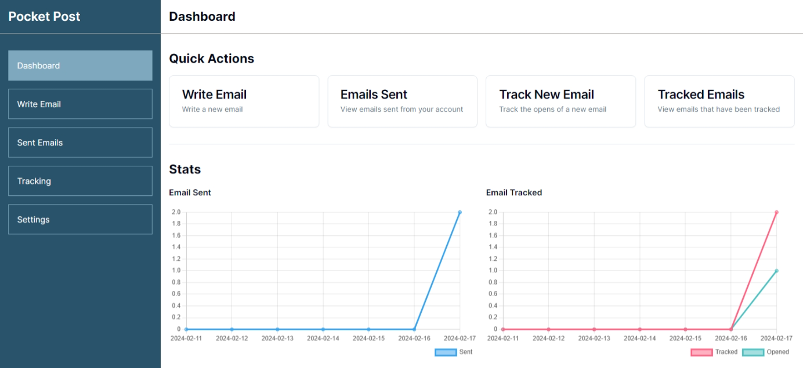

# Pocket Post

Email client for sending emails. Just Bring your API. We'll handle the rest.

## Features

- Send emails
- Track emails
- Manage email templates (planned)
- Manage email lists (planned)
- Manage email campaigns (planned)
- Manage email subscribers (planned)
- Manage email settings (planned)

## Prerequisites

- Node.js
- pnpm
- Postgres
- [Clerk.com](https://clerk.com) account
- [Helper Package](https://github.com/thtauhid/pocket-post-image-server)

## Installation

1. Clone the repository

```bash
git clone https://github.com/thtauhid/pocket-post
```

2. Install the dependencies

```bash
pnpm install
```

3. Create a `.env` file in the root directory and add the following environment variables

   - `DATABASE_URL` is the connection string for the Postgres database
   - `NEXT_PUBLIC_CLERK_PUBLISHABLE_KEY` & `CLERK_SECRET_KEY` can be obtained from [Clerk.com](https://clerk.com)
   - `IMG_SERVER_URL` is the URL of the [image server](https://github.com/thtauhid/pocket-post-image-server)

```bash
# Database
DATABASE_URL=

# Clerk
NEXT_PUBLIC_CLERK_PUBLISHABLE_KEY=
CLERK_SECRET_KEY=

# Image Server
IMG_SERVER_URL=
```

4. Start the development server

```bash
pnpm dev
```
